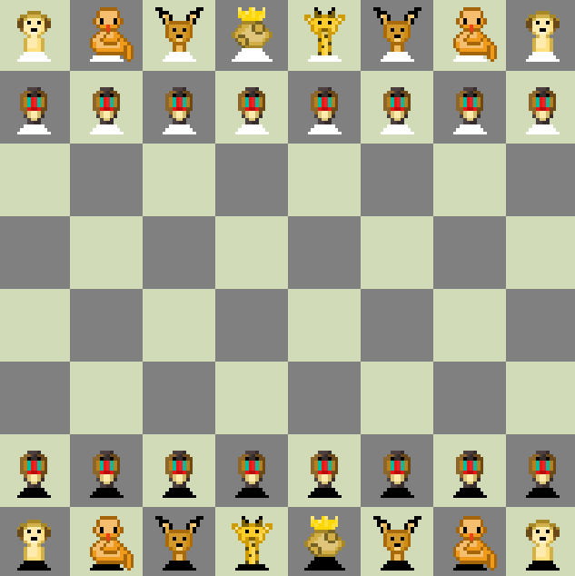

# Savanna_Strategy
A Chess inspired python game with a bit unorthadox pieces. Play vs a minimax computer player (rule-based AI). The goal of the project was to explore the implementation of the minimax algorithm with alpha-beta pruning, optimizing it through move ordering and heuristic evaluation techniques.
Avialable at: https://lukasbygmal.itch.io/savanna-strategy

## How to run
python main.py
